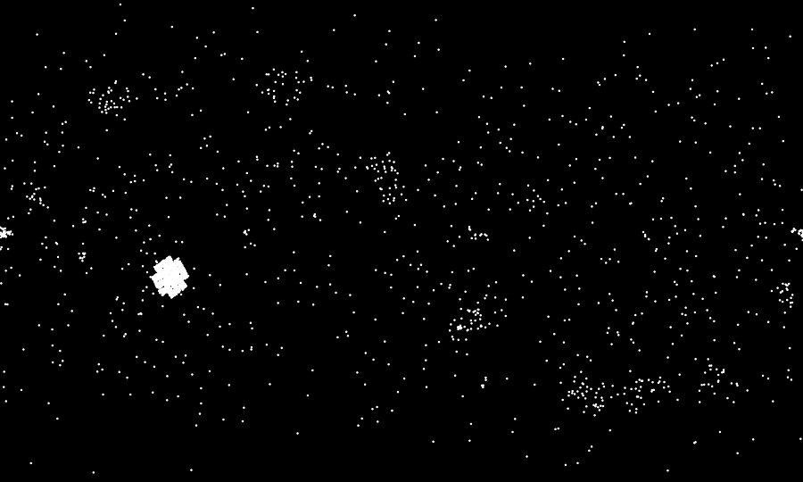
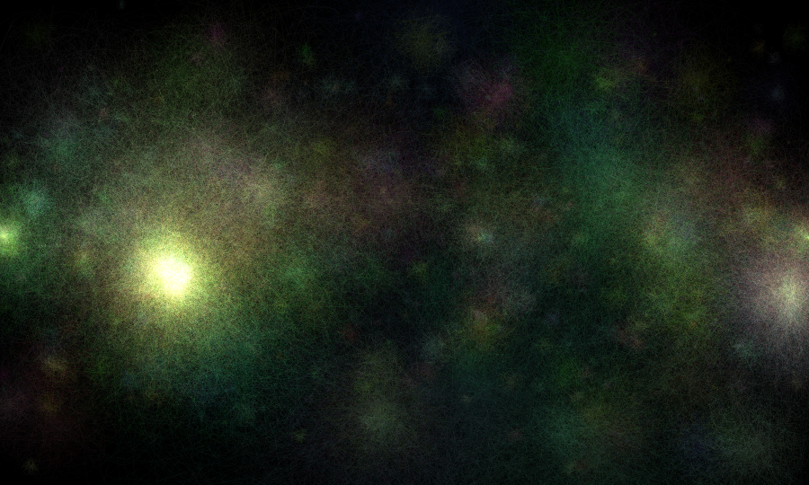
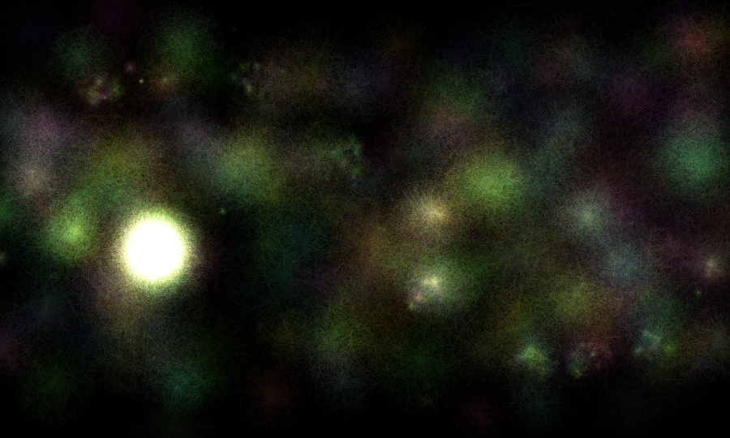

# Week 2: The Universe

This week's theme, proposed by me, is — o yes — the final frontier.

## Screenshots


## Explainer

The images were generated based on data from [Nasa Exoplanet Archive](http://exoplanetarchive.ipac.caltech.edu). I only used the position of the planets in the sky in [galactic coordinates](https://en.wikipedia.org/wiki/Galactic_coordinate_system) plus one parameter. The former were plotted in a cartesian map:



I couldn't find a reason for the cluster on the bottom left of the image, but I suspect it is only an especially studied part of the universe and not an abnormally dense one.

The extra parameter would give me a radius for the "fuzziness" around the planets. The image at the top uses the Orbital Period (`pl_orbper`).

```processing
int pl_orbper = constrain(row.getInt("pl_orbper"), 0, 300);
float radius = log(pl_orbper) * 100;
```

Others I tried were the Planet Mass (`pl_masse`),


```processing
float pl_masse = row.getFloat("pl_masse");
float radius = pl_masse/5;
```

and the Planet Radius (`pl_rade`), each with slightly different results.



```processing
float pl_rade = row.getFloat("pl_rade");
float radius = pl_rade * 30;
```

The arithmetic juggling is just a trick to bring the numbers to a usable range.

To generate the "fuzziness" I took one of the aforementioned parameters and used it to create a certain amount of random points around the position of the exoplanet. The larger the parameter (for instance, the larger the planet mass) the more points it would have around it.

```processing
positions = new PVector[int(diameter)];
for(int i = 0; i < int(diameter); i++){
  float randomR = random(diameter);
  float randomA = random(360);
  float thisX = cos(radians(i * randomA)) * randomR + x;
  float thisY = sin(radians(i * randomA)) * randomR + y;
  positions[i] = new PVector(thisX, thisY);
}
```

No points are actually drawn to the screen, but actually curves between the points. The color is generated randomly by cluster, but kept well within boundaries.
