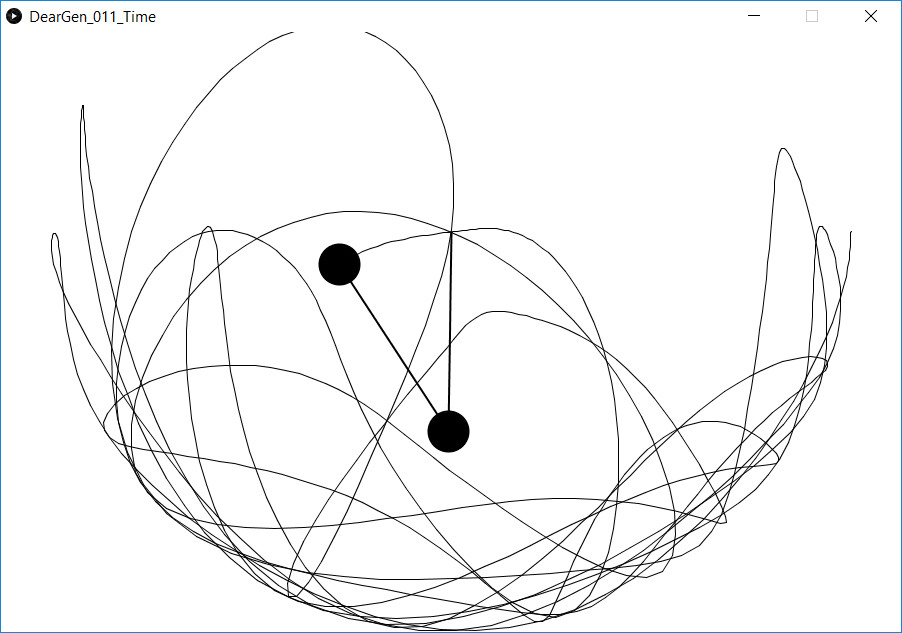

============
Time *Tempo*
============

.. figure:: ../assets/11-stockholm.jpg

    The final image for prompt Time (Tempo).

Inspiration
^^^^^^^^^^^

I remembered a recent tutorial on visualizing the double-pendulum equations, by Daniel Shiffman,
and decided I could use it as a starting point (see :commit:`05c8895`).

   The double-pendulum, implemented by Daniel Shiffman.

First change was to start drawing shapes, instead of lines (:commit:`cc72f65`):

.. figure:: ../assets/11-double-pendulum-shapes.png

