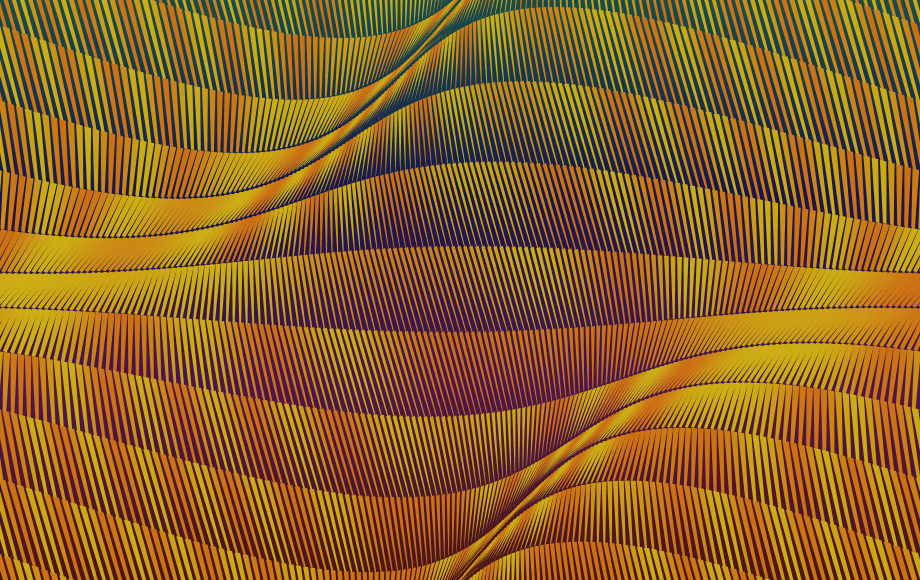
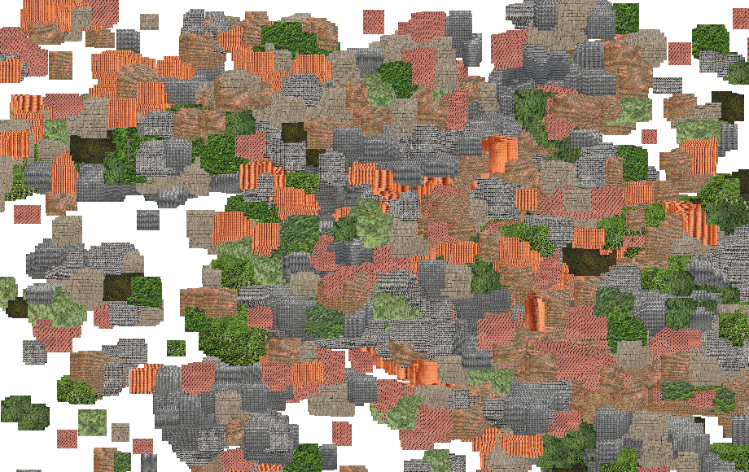
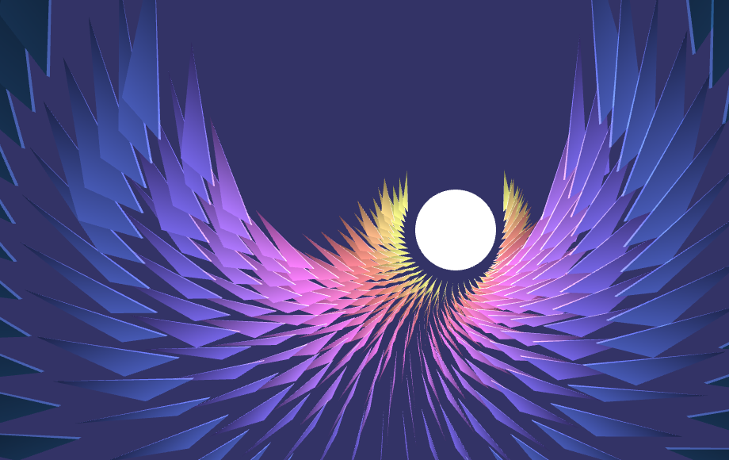
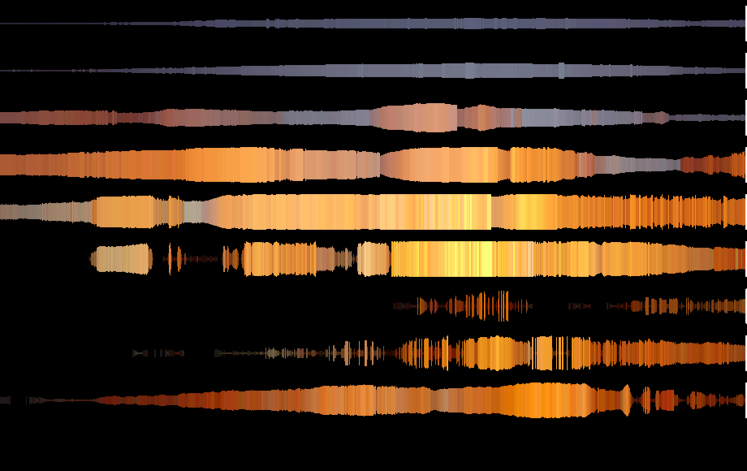

# Dear Gen
A generative postal art project

This project was inspired by [Dear Data](http://www.dear-data.com/) and conceived by [Half Scheidl](https://github.com/haschdl). It is as a series of weekly challenges meant to be sent by mail (the postal service, that is).

We are writing about each week as we go and the compiled text can be found at https://book.dear-gen.art/.

## Contents

### [Week 1: Araucária](Week-01)

### [Week 2: The Universe](Week-02)

### [Week 3: Palha](Week-03)

### [Week 4: Infinitesimal](Week-04)

### [Week 5: Alphabet](Week-05)

### [Week 6: Flow](Week-06)

### [Week 7: Roof](Week-07)

### [Week 8: Birth](Week-08)

### [Week 9: Pantanal](Week-09)

