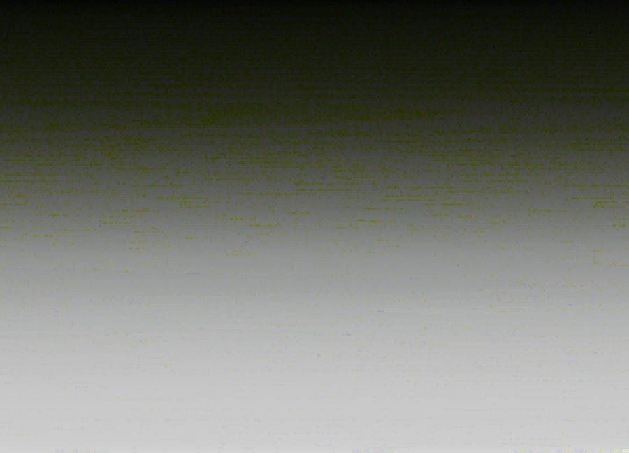

# Week 1: Araucária

From [Wikipedia](https://en.wikipedia.org/wiki/Araucaria):

> Araucaria (/ærɔːˈkɛəriə/; original pronunciation: [a.ɾawˈka. ɾja])[4] is a genus of evergreen coniferous trees in the family Araucariaceae. There are 20 extant species in New Caledonia (where 14 species are endemic, see New Caledonian Araucaria), Norfolk Island, eastern Australia, New Guinea, Argentina, Chile, and Brazil.

This week's theme was proposed by [Half](https://github.com/haschdl) and I didn't really stick to it. Instead I followed the code wherever it took me.

## Screenshots


These images were generated from an image which I can't share. So when you run the code you will see a different result. I encourage you to try with your own pictures and see what you get. Keep them small (about 300 px wide) if you don't want to wait for a century to render.

## Explainer

I started searching for images of araucária trees, which I find beautiful. Then I tried to capture their logic with some algorithm. The first draft is that attempt and can be seen in previous versions of the code (up to [6dfebaf357587c6513298256939ef758f90f8105](https://github.com/regisfrias/dear-gen/commit/6dfebaf357587c6513298256939ef758f90f8105)).

I got to a fractal structure that resembles some leaf patterns (not necessarily araucárias only). Then I decided to use the colours from an actual araucária tree picture. Initially I chose the colour based on the ellipse's position on screen, but I thought that was boring. Then I thought of ordering the colours by hue or brightness and only then use them. The idea was to give some directionality and sense of logic to it.

What I realised during this process was that the reordered pixels array looked very interesting in itself. So I used that instead of the image and trashed the fractal altogether.

It looks like this:


I took advantage of the fact that the hue is a bit misleading and doesn't seem to be totally ordered. That is just an optical illusion, the above image varies from reds to blues, greens are (obviously) in the middle. Try with a color picker!

For reference, here is the same image reordered by saturation:


More obviously ordered.

And by brightness:



Clearly ordered!

The sorting algorithm was shamelessly ripped off from [here](https://www.cs.cmu.edu/~adamchik/15-121/lectures/Sorting%20Algorithms/sorting.html) and is simingly simple:

```processing
int[] bubbleSort(int ar[]) {
  for (int i = (ar.length - 1); i >= 0; i--){
    for (int j = 1; j <= i; j++){
      if (hue(ar[j-1]) > hue(ar[j])){
        int temp = ar[j-1];
        ar[j-1] = ar[j];
        ar[j] = temp;
      }
    }
  }
  return ar;
}
```

The 3rd line (`if (hue(ar[j-1]) > hue(ar[j])){`) first gets the pixel's hue value before comparing it with the previously found value. Change that to `saturation(...)` or `brightness(...)` to create the previous two images.

The next step just replaces the pixels by ellipses spaced from each other and whose size — and opacity in the first example — vary according to brightness.
