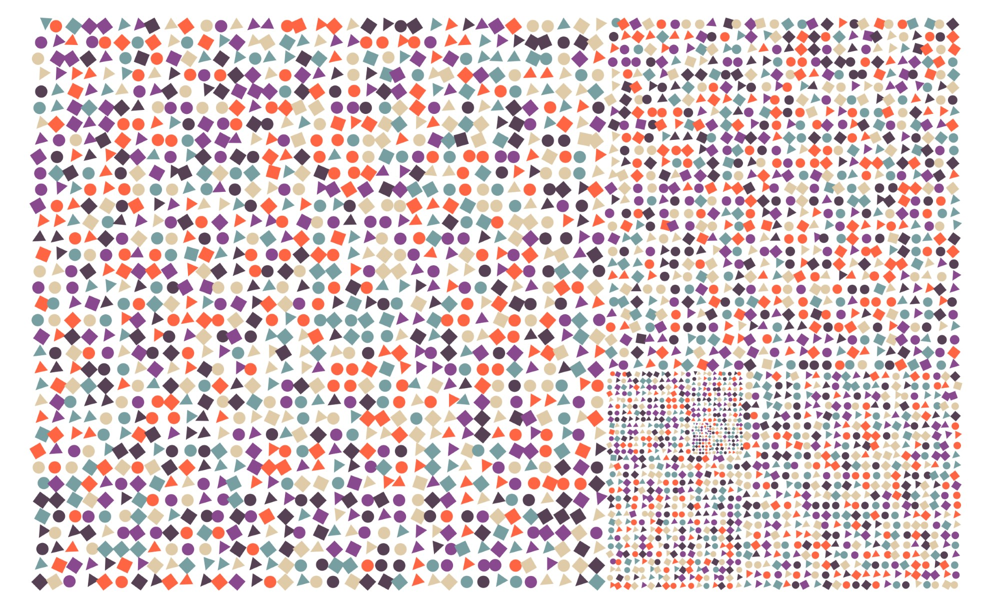

Universe *Universo*
===================

> This composition is part of the [index]{role="doc"} project.



The prompt `Universo` was announced without any fanfare, immediately
when we told each other that we had posted the first challenge,
[Week-01-Araucaria]{role="doc"}. It was Régis's first drawing prompt in
project.

The golden spiral and golden rectangle
--------------------------------------

I knew from the beginning that I would not be exploring ideas related to
galaxies and the stars. Instead, I wanted to surprise Régis with another
impression of infinity. I got some inspiration after looking into
[antique maps of the world and
stars](https://www.google.se/search?q=antique+maps+of+the+universe&source=lnms&tbm=isch&sa=X&ved=0ahUKEwj34-yZj5_bAhWLECwKHVg8AyIQ_AUICigB&biw=1536&bih=734),
and wanted to try something with the [golden
rectangle](https://en.wikipedia.org/wiki/Golden_rectangle) and its
subdivisions.

The first challenge was to draw the subdivisions. There are some more
sophisticated approaches using `scale()` command, but I couldn't get my
head around those, so I tried to reproduce the sequence from the largest
to the smaller squares in a loop, following the movement of the
subdivisions, in relation the previous one - basically drawing one
square, translating, drawing a smaller square etc. In every step, the
size of the rectangle `s` is divided by φ, getting smaller and smaller.
The algorithm is as follows
([Fig %s \<02-goldenrect-02\>]{role="numref"}):

1.  Translate to (0,1). This is the starting point (number 0 in the
    picture).
2.  Translate by **(0,-1)**.

    2.1. Draw a square with side `s` and calculate `s=s/phi`.

3.  Translate by **(φ,0)** units. This means 1 unit to the right
    (positive X), and same position in Y axis. Repeat 2.1
4.  Translate **(φ-1,φ)** units (going from square 2 to 3 in the
    picture). Repeat 2.1
5.  Translate **(-1,1/φ)** units (going from 3 to 4). Repeat 2.1
6.  Repeat steps 2-5 until `s` is very small

    > Drawing the golden rectangle and its subdivisions.

I put the movements described above in two arrays, one for each axis,
and used the modulus functions in the loop.

> The calculation `i%4` returns the rest of the division of `i` by 4,
> meaning it goes for 0 to 3, then back to 0 (see table below). Using
> the modulus operand for "looping" is a common and useful technique.

  ------------------------------------------------------------
  i         0   1   2   3   4   5   6   7   8   9   10   ...
  --------- --- --- --- --- --- --- --- --- --- --- ---- -----
  **i%4**   0   1   2   3   0   1   2   3   0   1   2    ...

  ------------------------------------------------------------

``` {.sourceCode .java}
//the directions in which the subdivisions "move"
moves_x = new float[]{0, +1*phi, phi -1, -1};
moves_y = new float[]{-1, 0, 1*phi, 1/phi};

float x = 0, y = h;
for (int i=0; i<iterations; i++) {
  y += h*  moves_y[i%4];
  x += h  * moves_x[i%4];
  universe[i] = new Subdivision(x + h/2, y+h/2, h);
  h/=phi;
}
```

To see the output with only the subdivisions drawn, locate and
un-comment `drawGold()`{.sourceCode}.
