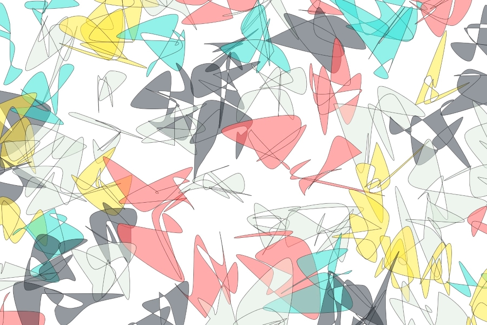
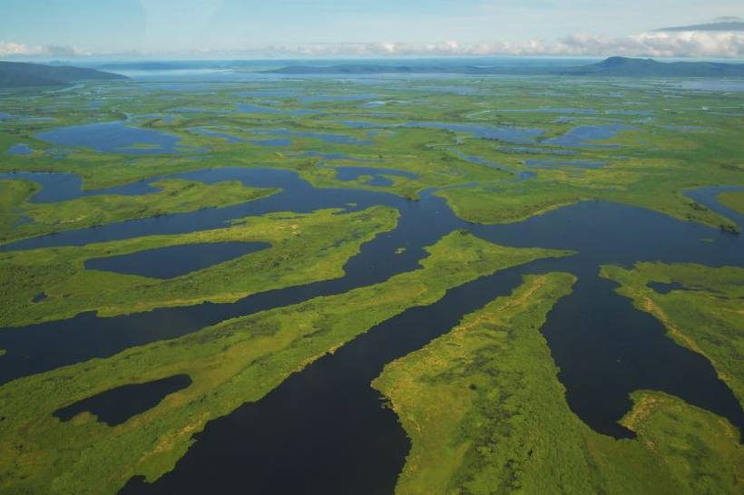
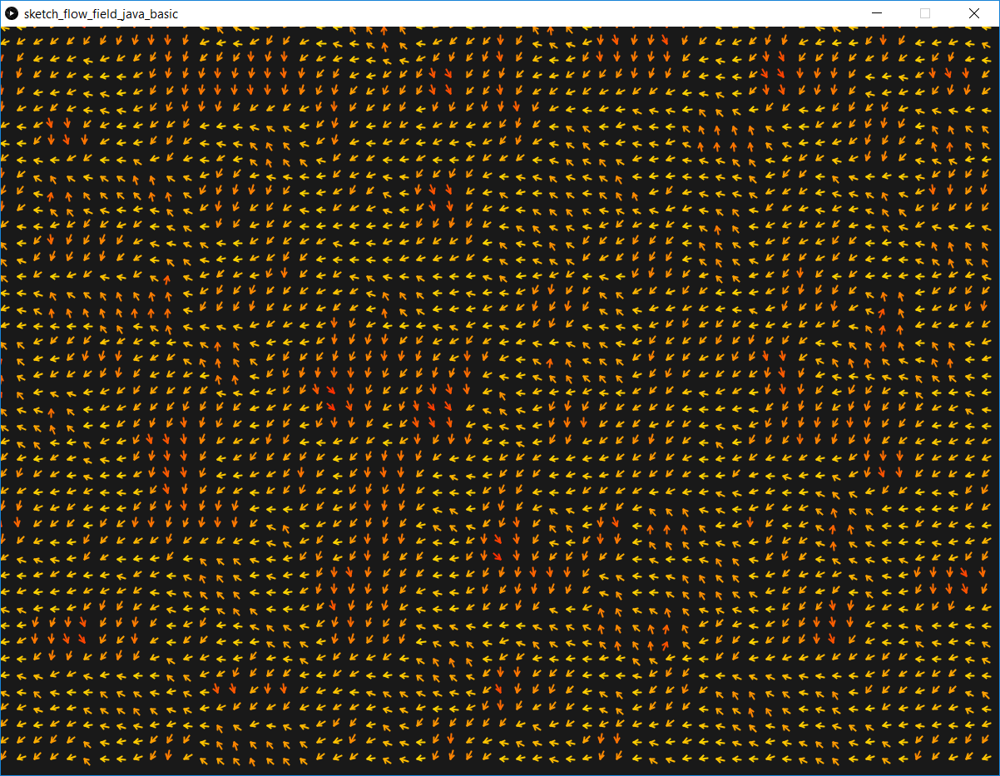
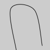
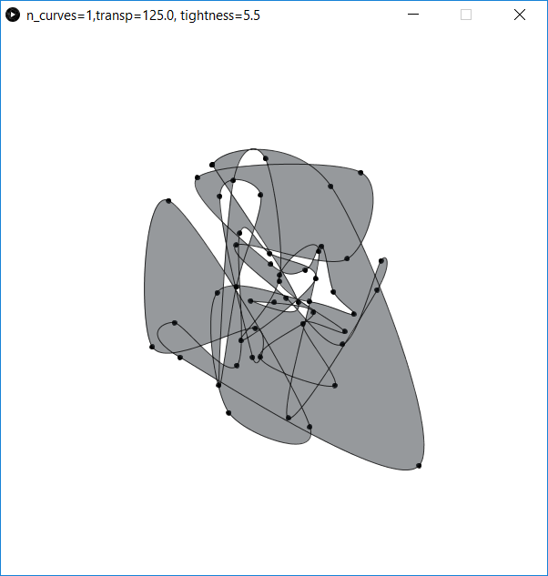

===================
Pantanal *Pantanal*
===================

    The final image for prompt Pantanal (Pantanal).

The prompt
----------
`Pantanal` is the name of the large wetlands region, located mostly in Brazil and portions of Bolivia and Paraguay. 
The area has a diverse flora and fauna, however my first mental image of Pantanal are the bodies of water during 
the flooded season.  

The creative process
--------------------
I first experimented flow fields, in which the direction of the vectors are calculated using the |p_noise| function.

   Flow field example. `Source code </DearGen_009_FlowField_Basics/>`_

In the example above, I colored the arrows according to the angle. In Processing, you can use `heading()`
method to calculate the direction (in radians) of a vector. I considered first drawing curves around the 
different regions - for example, the warmer areas in the flow field could delineate a blob, which I 
visualized as being one of the water bodies.

.. code-block:: java
 
   float hue1 = map(abs(v1.heading()), 0, TWO_PI, 0, 100);
   stroke( hue1, 100, 100);
   fill(hue1, 100, 100);

Trying to move move forward with this idea, I started playing with |p_curveVertex|. 

   The first and last points in a series of curveVertex() lines will be used to guide the 
   beginning and end of a the curve. A minimum of four points is required to draw a tiny 
   curve between the second and third points. Adding a fifth point with curveVertex() will 
   draw the curve between the second, third, and fourth points. The curveVertex() function 
   is an implementation of Catmull-Rom splines. 

.. code-block:: Java
      :caption: Source code for curveVertex()

      noFill();
      beginShape();
      curveVertex(84,  91);
      curveVertex(84,  91);
      curveVertex(68,  19);
      curveVertex(21,  17);
      curveVertex(32, 100);
      curveVertex(32, 100);
      endShape();
   

   A curve drawn with `curveVertex()`.

Before trying to draw smooth, convex curves, I played with calling `curveVertex()` passing 
random points, randomized with the randomGaussian() function. You can run this example from 
the `Curve vertex basics <DearGen_009_CurveVertex_Basics.pde>`_  sketch. 

   Playing with curveVertex(). Small circles drawn on the location of the vertices.

From there, it was simply a matter of drawing multiple of such curves, varying color and position, 
to achieve the final result.

