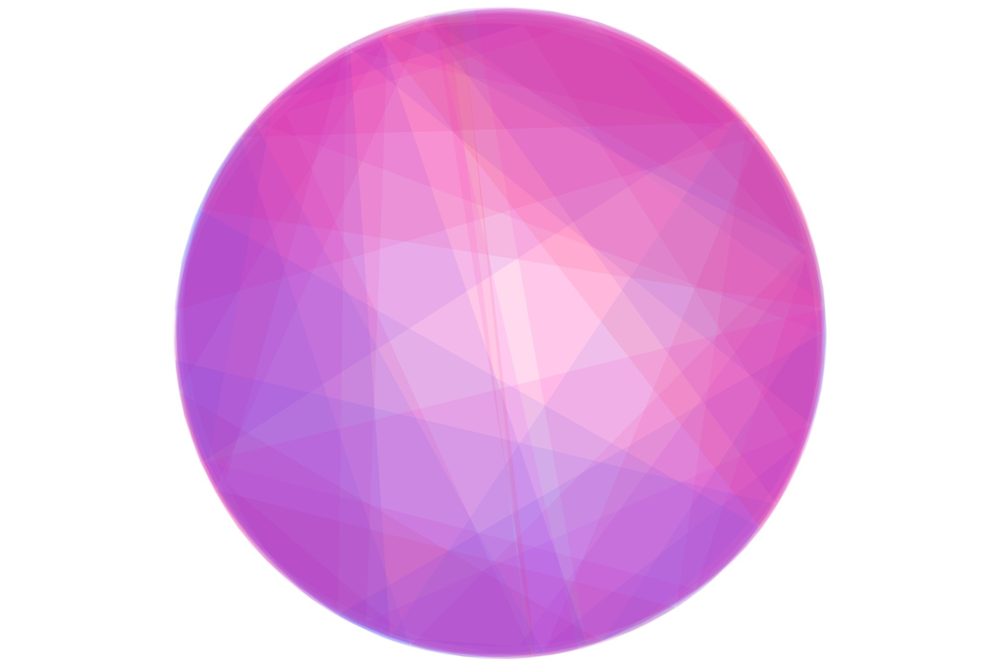
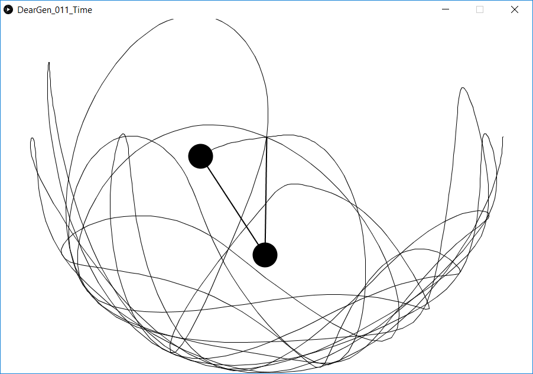

============
Time *Tempo*
============

    The final image for prompt Time (Tempo).

Inspiration
^^^^^^^^^^^

I remembered a recent tutorial on visualizing the double-pendulum equations, by Daniel Shiffman,
and decided I could use it as a starting point (see :commit:`aaed88f`).

   The double-pendulum, implemented by Daniel Shiffman.

First change was to start drawing shapes, instead of lines (:commit:`e04fbb7`):

.. figure:: ../assets/11-double-pendulum-shapes.png

Next change was to hide the pendulum drawing (lines 69-75), and color to the shapes:

.. code-block:: Java
   :emphasize-lines: 1,3
   
   canvas.noStroke();
   if (frameCount > 1) {
      canvas.fill(abs( sin(a1)) * 360, sin(a2)*100, 100, 20);
      canvas.vertex(px2, py2);
      canvas.vertex(x2, y2);
   }

