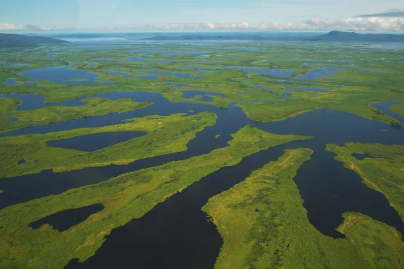
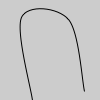
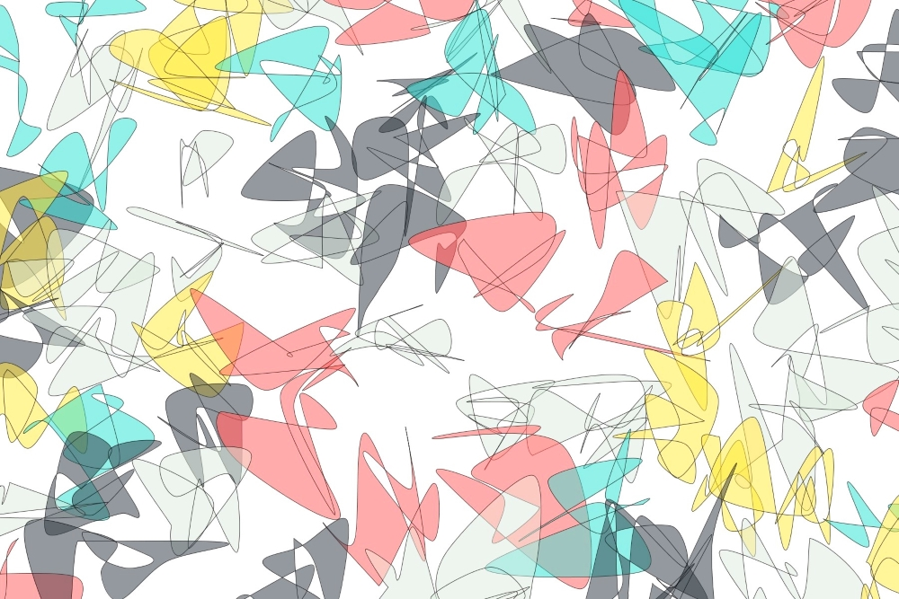

Pantanal *Pantanal*
===================


The prompt
----------

Pantanal is the name of the large wetlands region, located mostly in
Brazil and portions of Bolivia and Paraguay. The area has a diverse
flora and fauna, however my first mental image of Pantanal are the
bodies of water during the flooded season.



The creative process
--------------------

I first experimented flow fields, in which the direction of the vectors
are calculated using the function.

](../assets/09-flow-field-basics.png)

In the example above, I colored the arrows according to the angle. In
Processing, you can use heading() method to calculate the direction (in
radians) of a vector. I considered first drawing curves around the
different regions - for example, the warmer areas in the flow field
could delineate a blob, which I visualized as being one of the water
bodies.

``` {.sourceCode .java}
float hue1 = map(abs(v1.heading()), 0, TWO_PI, 0, 100);
stroke( hue1, 100, 100);
fill(hue1, 100, 100);
```

Trying to move move forward with this idea, I started playing with .

> The first and last points in a series of curveVertex() lines will be
> used to guide the beginning and end of a the curve. A minimum of four
> points is required to draw a tiny curve between the second and third
> points. Adding a fifth point with curveVertex() will draw the curve
> between the second, third, and fourth points. The curveVertex()
> function is an implementation of Catmull-Rom splines.

``` {.sourceCode .Java}
noFill();
beginShape();
curveVertex(84,  91);
curveVertex(84,  91);
curveVertex(68,  19);
curveVertex(21,  17);
curveVertex(32, 100);
curveVertex(32, 100);
endShape();
```



Before trying to draw smooth, convex curves, I played with calling
curveVertex() passing random points, randomized with the
randomGaussian() function. You can run this example from the [Curve
vertex basics](DearGen_009_CurveVertex_Basics.pde) sketch.


From there, it was simply a matter of drawing multiple of such curves,
varying color and position, to achieve the final result.


