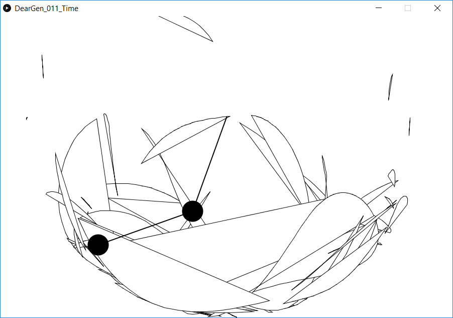

Time *Tempo*
============


Inspiration
-----------

I remembered a recent tutorial on visualizing the double-pendulum
equations, by Daniel Shiffman, and decided I could use it as a starting
point (see [aaed88f]{role="commit"}).


First change was to start drawing shapes, instead of lines
([e04fbb7]{role="commit"}):



Next change was to hide the pendulum drawing (lines 69-75), and color to
the shapes:

``` {.sourceCode .Java}
canvas.noStroke();
if (frameCount > 1) {
   canvas.fill(abs( sin(a1)) * 360, sin(a2)*100, 100, 20);
   canvas.vertex(px2, py2);
   canvas.vertex(x2, y2);
}
```
