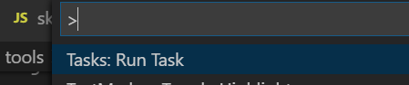
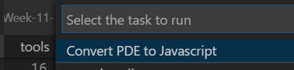

# PDE to Javascript 

We decided to convert all sketches from Java (.pde files) to Javascript 
(using p5.js). For most sketches this is a straight-forward process: 
most Processing functions will have an equivalent function in p5.js.

I created a short utility to run a first conversion of a PDE file 
into Javascript. The generated file is by no means ready, and several
changes will still need to be changed, depending on how complex are you
sketches.

# How to run

These steps assume you have the repo cloned and open in VSCode.
It also requires Python 3 installed and available in the path.

1. Have the PDE file open in VSCode as your current file.
2. In VSCode, open the tasks menu (F1 in Windows), then `Tasks: Run Task`

3. Choose **Convert PDE to Javascript**

# Troubleshooting

VSCode task is defined in `.vscode\tasks.json`.
The task **Convert PDE to Javascript** runs
the script `pdeToJs.py` for the active file, and
creates a javascript `converted.js`.
It is up to you to rename the file, or copy and paste
its contents into the final `sketch.js` file.

